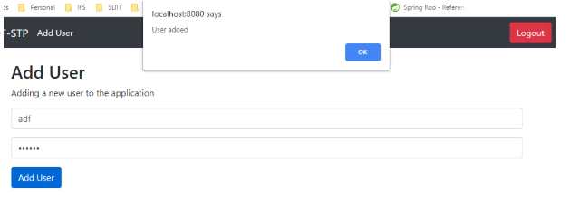
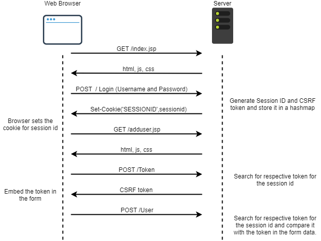
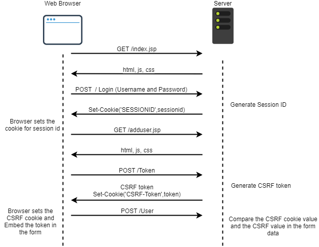

# CSRF Implementation

This blog explains two demo applications that were built to demonstrate two strategies in defending against CSRF attacks. The two methods are “Synchronizer Token Pattern” and “Double Submit Cookie Pattern” and the applications can be found at,

- https://github.com/Aaquiff/csrf-synchronizer-token-pattern-example
- https://github.com/Aaquiff/csrf-double-submit-cookie-example

You can also refer to my [article](../cross-site-request-forgery/Readme.md) where I have discussed about CSRF and it’s 
prevention mechanisms.

This application allows the administrator to add users. The steps to add a user are given below with screenshots.

1. Login To the application using the admin credentials “aaralk/aaralk”.  

2. Click on the “Add User” option, you will be presented with the form to add a user.

3. Enter the username and password for the new user to be added, if you are logged into the system as the administrator, the user will be added.

## Synchronizer Token Pattern

In this method, the server generates a token for each session id and stores it in a key value store. The next time the form loads, it requests the token from the server to which the server responds with the token value(corresponding to the session id) and the browser embeds the token in the form. When the form is posted with the form data, the token is sent along with the form data since it is embedded inside the form. The server then validates the received token against the token in the server(that maps to the session id) to check they are equal. If so we can confirm that the request has come from the form that we have provided to the user. The diagram below illustrates the flow of communication between the browser and the server during this.

This can help avoid cross site scripting. However when there are huge number of connections open, the server needs to maintain these tokens and this would be problematic in terms of storage and performance. To avoid the need for the server to store tokens, an alternative pattern called Double Submit Cookie Pattern is used.

## Double Submit Cookie Pattern

Double submit cookie pattern is efficient than STP since it does not require the server to store the tokens in the server. How this works is, instead of storing the token in the server, a cookie is set in the browser with the token when the token is sent to the browser. Now the browser has the token embedded in the form as well as in the cookie. When the form is posted, the server retrieves the token value from the cookie and the form data and compares each other. If they match, we know that the request come from the correct form.

